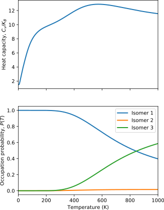

Usage example
=============

OccuProb can also be used as a Python API and coupled to other programs that calculate
the required properties. This approach is more flexible than using the CLI,
since its not limited to a specific input or output format.

The following is an example script used to calculate and plot the occupation probability and the heat
capacity for the isomers of a Pt\ :sub:`5` cluster:

.. code-block:: python

  import numpy as np

  import matplotlib.pyplot as plt

  from occuprob.superpositions import SuperpositionApproximation
  from occuprob.partitionfunctions import ElectronicPF, QuantumHarmonicPF, RotationalPF

  # Potential energy values in eV
  energy = np.array([-4433.120, -4433.012, -4432.936])
  # Frequencies in THz
  frequencies = np.array([[0.89, 1.53, 2.13, 3.17, 4.29, 5.41, 5.69, 6.08, 7.22],
                          [2.11, 2.13, 2.87, 2.92, 4.46, 4.52, 4.59, 5.11, 6.55],
                          [0.87, 1.07, 1.52, 3.01, 3.85, 4.35, 4.96, 5.83, 6.89]])
  # Order of the rotational subgroup of the point group symmetry
  symmetry = np.array([2., 6., 1.])
  # Spin multiplicity
  spin = np.array([3., 5., 5.])
  # Principal moments of inertia
  moments = np.array([[1163.57, 3017.17, 4175.72],
                      [1295.15, 2480.99, 2482.24],
                      [1170.75, 2997.96, 4168.35]])

  # Electronic, vibrational and rotational contributions to the individual
  # partition functions of each isomer
  partition_functions = [ElectronicPF(energy, spin),
                         QuantumHarmonicPF(frequencies),
                         RotationalPF(symmetry, moments)]
  superposition = SuperpositionApproximation()
  superposition.add_partition_functions(partition_functions)

  # Temperature range from 0 K to 1000 K, divided in steps of 1 K
  temperature = np.arange(0, 1001, 1)

  # Calculates the occupation probability of each isomer
  occupation_probability = superposition.calc_probability(temperature)
  # Calculates the heat capacity at constant volume
  heat_capacity = superposition.calc_heat_capacity(temperature)

  # Plots
  fig, (ax1, ax2) = plt.subplots(2, 1, figsize=(5, 7), sharex=True, sharey=False)

  ax1.set_ylabel(r"Heat capacity, $C_v/K_B$")
  ax2.set_ylabel(r"Occupation probability, $P(T)$")
  ax2.set_xlabel(r"Temperature (K)")
  ax2.set_xlim((temperature.min(), temperature.max()))

  # Plots the occupation probability of each isomer
  for n, probability in enumerate(occupation_probability):
      ax2.plot(temperature, probability, linewidth=2, label=f"Isomer {n+1}")
  ax2.legend()

  # Plots the heat capacity
  ax1.plot(temperature, heat_capacity[0], linewidth=2)

This script produces the following plot:

In this case, the properties of the isomers are provided as NumPy arrays. The contributions
to the total partition function of each isomer are calculated using the classes ``ElectronicPF``,
``QuantumHarmonicPF`` and ``RotationalPF``. The ``SuperpositionApproximation`` class
combines the partition function contributions and provides methods to calculate the
occupation probability, the heat capacity at constant volume and ensemble-averaged
properties.
