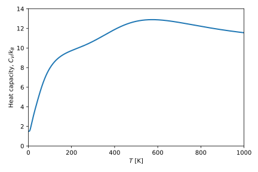
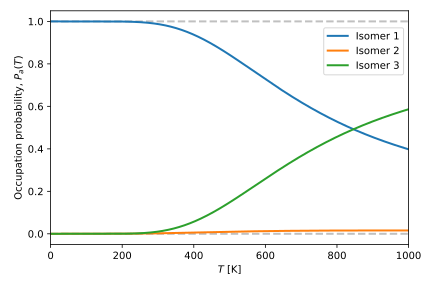

Command-line interface
======================

.. autosummary::
   :toctree: autosummary

OccuProb includes a basic command-line interface (CLI) to calculate the occupation
probability and heat capacity for a set of isomers.

Input file format
-----------------

At the moment, OccuProb only supports input files in the Extended XYZ format.
The Extended XYZ format enhances the standard XYZ files by replacing the comment
line with a series of key/value pairs. In the case of OccuProb, the required keys
are: *Energy*, for the potential energy; *Multiplicity*, for the spin multiplicity;
and *Frequencies*, for the vibrational mode frequencies. For example, for a Pt\ :sub:`5`
cluster with three isomers, the respective Extended XYZ file is:

.. code-block:: none

  5
  Properties=species:S:1:pos:R:3 Energy=-4433.120 Multiplicity=3 Frequencies="0.89 1.53 2.13 3.17 4.29 5.41 5.69 6.08 7.22"
  Pt       6.021536241   7.747189364   2.514796921
  Pt       7.396161795   5.832164691   3.355579003
  Pt       5.773696513   7.056151430   4.817413600
  Pt       4.255814915   8.954527174   5.248344983
  Pt       4.507518660   9.657859127   2.902251298
  5
  Properties=species:S:1:pos:R:3 Energy=-4433.012318052181 Multiplicity=5 Frequencies="2.11 2.13 2.87 2.92 4.46 4.52 4.59 5.11 6.55"
  Pt       7.130670563   7.316490254   2.574869115
  Pt       7.205709764   9.241865499   4.365106937
  Pt       5.777733370   7.145289063   4.820088212
  Pt       4.881553705   9.498560523   5.571968924
  Pt       5.039802176   8.845583983   3.029309097
  5
  Properties=species:S:1:pos:R:3 Energy=-4432.936040563171 Multiplicity=5 Frequencies="0.87 1.07 1.52 3.01 3.85 4.35 4.96 5.83 6.89"
  Pt       6.723845677   6.893128486   2.292499726
  Pt       7.293610863   5.327356394   4.136932256
  Pt       5.761431903   7.076877369   4.975889864
  Pt       4.188319017   8.952644393   5.368553185
  Pt       5.151406283   8.677468180   3.099167433

Additional details of the Extended XYZ format can be found
`here <https://wiki.fysik.dtu.dk/ase/ase/io/formatoptions.html#ase.io.extxyz.read_extxyz>`_.

Usage example
-------------
For the aforementioned example of the Pt\ :sub:`5` clusters, the occupation
probability of each isomer and the heat capacity at constant volume can be calculated
by running:

.. code-block:: console

	occuprob Pt5_isomers.xyz -SQR --max_temp=1000 --plot --size 6 4

The first argument is the name of the input file (``Pt5_isomers.xyz``). The -SQR
flags indicate the contributions to the partition function of each isomer that
will be calculated: the electronic partition function including spin (``-S``);
the vibrational partition function in the quantum harmonic oscillator approximation (``-Q``);
and the rotational partition function (``-R``). These two first arguments are required
for every calculation, while the rest are optional. By using ``--max_temp`` you
can specify the upper limit of the temperature range used in the calculations.
The argument ``--plot`` must be used if you wish to save the results as image files,
otherwise they will only be saved as plain text files. The argument ``--size`` defines
the size (width and height, in inches) of the output images. In this example, OccuProb
produces the following images for the heat capacity and the occupation probabilities
of Pt\ :sub:`5`:

List of options
---------------

========================= ==================================================================
**Argument**              **Function**
------------------------- ------------------------------------------------------------------
in_file                   Extended XYZ file contaning the list of isomers
-e, -E                    Add electronic partition function
-s, -S                    Add electronic partition function (including spin)
-c, -C                    Add vibrational partition function (classical harmonic)
-q, -Q                    Add vibrational partition function (quantum harmonic)
-r, -R                    Add rotational partition function
--out_file OUT_FILE       Output filename prefix
--plot_format PLOT_FORMAT Output image files plot_format (default: SVG)
--min_temp MIN_TEMP       Maximum temperature in K (default: 0)
--max_temp MAX_TEMP       Maximum temperature in K (default: 500)
--plot                    Plot the results and save them as image files
--size SIZE SIZE          Width and height of the output image, in inches (default: 8.0 6.0)
========================= ==================================================================
